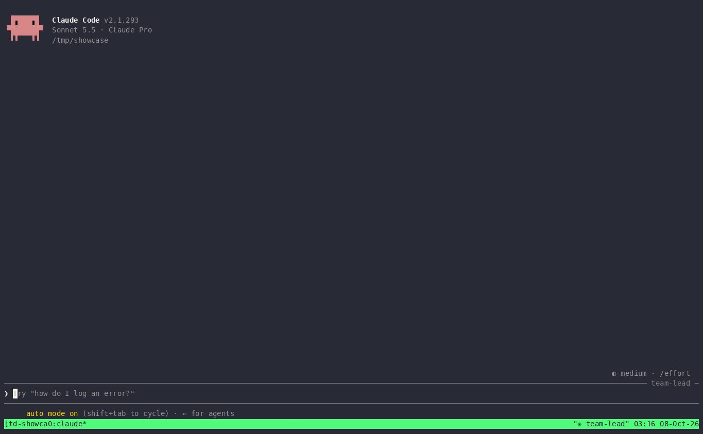

# team-desk

[](https://github.com/Francesco-Av28/team-desk/actions/workflows/ci.yml)
[](LICENSE)

**Team di agenti Claude Code su tmux, con regole e budget.** Un leader coordina; ogni membro fa un solo lavoro,
con il modello adatto, dentro i file che gli spettano, dopo i membri da cui dipende.

*[Read in English](README.md)*



## Perché

La mia prima sessione con un team di agenti ha consumato **36,6 milioni di token in un'ora**. Tutti i compagni giravano
sul modello del leader (Opus), il leader ha avviato in anticipo nove fasi che restavano in attesa, e un membro di
"ricerca di mercato" ha raccolto 517 recensioni senza alcun limite. I numeri sono nel [case study](examples/chess-clone/CASE_STUDY.md).

team-desk trasforma quelle lezioni in impostazioni predefinite:

| Problema visto | Default di team-desk |
|---|---|
| I compagni ereditano il modello costoso del leader | Modello per **tipo di lavoro**: `research` Haiku, `design`/`doc`/`review` Sonnet, `code` Opus. Compagni `general-purpose` vietati |
| Fasi avviate prima che esistano i loro input | Dipendenze `after`: un membro parte solo quando esiste il `.done` di chi lo precede |
| Troppi membri insieme | `max_active` (default 2) |
| Ricerca e scraping senza limiti | 25 turni e 10 ricerche web per membro, niente scraping |
| Membri che si sovrascrivono i file | `owns` per membro, fatto rispettare da un hook PreToolUse |
| La spesa si scopre a cose fatte | `team-desk cost` per membro, soglie al 50% e 80% del budget |
| Ctrl+Z (l'"annulla" di Windows) sospende Claude nel pannello | configurazione tmux opzionale che lo trasforma in annulla |

## Requisiti

Linux, WSL2 o macOS · `python3` (solo libreria standard) · `tmux` · [Claude Code](https://docs.claude.com/en/docs/claude-code)
con gli agent team (team-desk imposta `CLAUDE_CODE_EXPERIMENTAL_AGENT_TEAMS=1` solo nella propria sessione).

## Installazione

```bash
git clone https://github.com/Francesco-Av28/team-desk.git
cd team-desk && ./install.sh            # collega ~/.local/bin/team-desk e ~/.claude/skills/team-desk
team-desk tmux-conf                     # opzionale: mostra la config tmux; con -y la installa (con backup)
```

## Avvio rapido

```bash
cd mio-progetto
team-desk init --propose     # analizza progetto e skill, propone un team, scrive team.json
# oppure, dentro Claude Code: /team-desk   (intervista con opzioni cliccabili)
team-desk up                 # sessione tmux: leader a sinistra (60%), i membri compaiono a destra
```

Il leader ti chiede conferma prima di avviare ogni membro. Intanto, da un altro terminale:

```bash
team-desk status    # in attesa / pronto / al lavoro / bloccato / fatto, e chi è il prossimo
team-desk cost      # turni e token per membro, quota del budget
team-desk dash      # sessione tmux separata che aggiorna stato + costi ogni 30 s
team-desk stop      # Esc in ogni pannello (prima il leader): ferma il lavoro, non chiude nulla
team-desk down      # chiude la sessione del team e la dashboard
```

## team.json

Lo schema completo, con un esempio, è nel [README inglese](README.md#teamjson). In breve:

| Campo | Significato |
|---|---|
| `work` | `research`, `design`, `doc`, `code` o `review`: decide modello e tool di default |
| `role` / `skill` | un compito descritto a parole, una skill da seguire, o entrambi |
| `owns` | i percorsi in cui il membro può scrivere (relativi al progetto, o assoluti per codice tenuto altrove) |
| `after` | i membri che devono aver finito prima |
| `inputs` | i file da leggere per primi |
| `model`, `tools`, `max_turns`, `max_fetches` | eccezioni per singolo membro |

`total_tokens` è in **token pesati**: input 1×, lettura da cache 0,1×, scrittura in cache 1,25×, output 5× (i rapporti
di prezzo di Anthropic). Misura la spesa relativa, vale sia per l'API sia per gli abbonamenti; non è un importo in euro.

## Limiti (v0.1)

- Il tetto di turni usa il campo `maxTurns` degli agenti; il tetto di ricerche web e il divieto di scraping sono istruzioni, non blocchi tecnici.
- L'hook `owns` controlla i tool che scrivono file (Write, Edit, MultiEdit, NotebookEdit), non i comandi da shell.
- Negli ultimi test (Claude Code 2.1.293) gli hook scritti dentro il file di un agente non venivano eseguiti: per questo il controllo è un hook di progetto.
- Gli agent team sono una funzione sperimentale di Claude Code e il comportamento può cambiare tra versioni.

## Licenza e nome

Codice: [Apache License 2.0](LICENSE). Il nome "team-desk" e il suo logo non sono coperti dalla licenza (vedi [NOTICE](NOTICE)).
